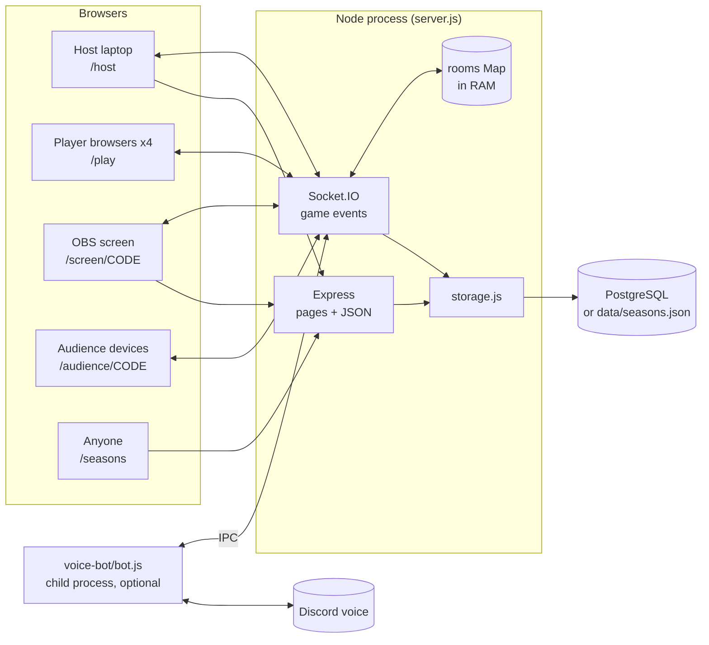
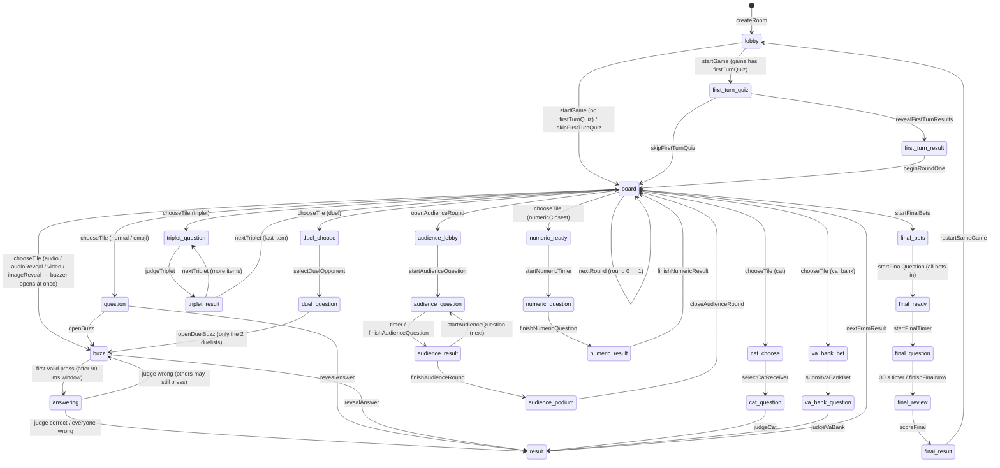

# Architecture — SMOKERLOL Quiz ("Своя гра")

> **Snapshot:** commit `46e0620` (2026-10-09). All `file:line` references point to that commit and **will drift** after edits.
> **Companion doc:** [`found_bugs.md`](found_bugs.md) lists the verified bugs.
> **Rule used while writing this:** every statement comes from reading the code or running it. Anything not checked is marked **UNVERIFIED**.

---

## ⚡ TL;DR (read this, skip the rest if busy)

- It's a **live quiz show** in the style of *Jeopardy*. There's **1 host**, **up to 4 players** (each in their own browser: usually on a computer, sometimes a phone, per the owner's side), an **OBS stream screen**, and optional **audience devices**.
- **One Node.js process** does everything: `server.js` (Express + Socket.IO, 1,472 lines, all game rules).
- **Game state lives only in RAM.** A restart or redeploy kills all running games.
- **Season results** (leaderboards) are the only thing that's kept: PostgreSQL if `DATABASE_URL` is set (**production uses PostgreSQL**), otherwise a JSON file.
- **Clients are plain HTML files** with inline JavaScript in `public/`. No build step, no framework.
- **Quiz content** is JSON in `games/`. Adding a game = add a JSON file + an entry in `games/index.json` + **restart the server** (games are loaded once at startup, `server.js:14-19`).
- There are **no automated tests, no linter, no CI**. `tests/ai_repro/` holds manual reproduction scripts for `found_bugs.md`.

---

## 🗺️ 1. The big picture



**How a game works, in one breath:** the host creates a room → gets a 4-letter code → players join with the code in their browser → the host drives the game with buttons, and players buzz, bet, answer and pick tiles on their turn → each action is a Socket.IO event → the server changes the room → the server broadcasts a fresh `state` object → every screen re-renders from that state.

(Every page is also loaded over plain HTTP. The diagram's HTTP arrows show the JSON data requests.)

---

## 📁 2. Files: what matters, what's dead

### Files that actually run

| File | Size | What it is |
|---|---|---|
| `server.js` | 1,472 lines | **Everything server-side:** HTTP routes, all 84 socket event handlers, all game rules, timers, the Discord bridge. No `module.exports`. Starts listening as soon as it's loaded (`server.js:1454`). |
| `storage.js` | 87 lines | Seasons and leaderboards. PostgreSQL **or** a JSON file. |
| `public/host.html` | 528 lines | Host control panel. |
| `public/play.html` | 490 lines | Player UI (works on desktop and mobile browsers; has mobile-specific CSS). |
| `public/screen.html` | 392 lines | OBS Browser Source (the stream view). |
| `public/audience.html` | 17 lines | Audience mini-game on viewers' devices. |
| `public/seasons.html` | 8 lines | Public leaderboard page. |
| `public/index.html` | 1 line | Landing page with 3 links. |
| `public/common.js` | 6 lines | `GameUI.esc` (HTML escape), `playersHTML`, `boardHTML`. |
| `public/style.css` | 34 lines | Shared styles. |
| `public/media/`, `public/images/`, `public/sounds/` | ~97 MB | Quiz media, plus 2 cue sounds. |
| `games/index.json` + `games/*.json` | — | Quiz content. Only the files listed in `index.json` are loaded (`server.js:14-19`). |
| `voice-bot/bot.js` | 53 lines | Optional Discord "who is speaking" bot, run as a child process. |
| `render.yaml` | — | Render.com deploy config (free plan, `npm start`, health check `/health`). |

### Files that do NOT run (safe to ignore; candidates for deletion)

| File(s) | Why they're dead |
|---|---|
| Root `host.html`, `play.html`, `screen.html`, `index.html`, `seasons.html`, `style.css`, `common.js` | Old copies. Express only serves `public/` (`server.js:38`). Last changed 2026-09-09. The real files in `public/` changed up to 2026-10-09. |
| Root `kinohardkor.json`, `index.json` | Old copies. The server reads `games/` (`server.js:14`). |
| Root `questions.json` | Served at `/questions.json` (`server.js:50`), but **no client requests it** (checked with grep). |
| `download` | Byte-identical to `.gitignore` (same git blob). Nothing references it. |
| `games/back_to_2000s.draft.json`, `games/back_to_2000s_round2_approved.draft.json`, `games/media_test.json` | Not listed in `games/index.json`, so never loaded. |

---

## 🌐 3. HTTP routes (`server.js:28-65`)

| Route | Returns | Notes |
|---|---|---|
| *(all except `/socket.io/`)* | — | `Cache-Control: no-store` on everything, **including media files** (`server.js:28-36`). Browsers are told not to store any of it. |
| `/` `/host` `/play` `/screen` `/screen/:code` `/audience` `/audience/:code` `/seasons` | HTML pages from `public/` | |
| static `public/*` | files | `express.static`, `etag:false`, `maxAge:0`. |
| `/games` | list of enabled games (without `file`) | |
| `/games/:id.json` | **full game JSON, including all answers**; only `specialSetup` and `specialPools` are removed (`server.js:58`) | Public, no auth. See PARK-05 in `found_bugs.md`. |
| `/audience-qr/:code` | SVG QR code of `<protocol>://<host>/audience/CODE` | Uses `req.protocol`; no `trust proxy` setting. See PARK-12. |
| `/api/seasons` | all seasons, games, leaderboards (`storage.publicData`) | Public. Includes saved-game IDs. |
| `/health` | `{ok, version:'3.1.0-dev', rooms}` | |
| `/questions.json` | root `questions.json` | Unused. |

---

## 👤 4. Who is who (identity & permissions)

There are **no accounts and no passwords anywhere**. Identity = "you hold this ID or token".

| Role | How identity is created | Stored where (browser) | What proves it on the server | Can do |
|---|---|---|---|---|
| **Host** | The client invents a UUID (`host.html:170`); the server accepts whatever the client sends (`server.js:375`) | `localStorage.sgHostToken`, `sgRoomCode` | `socket.data.hostToken === room.hostToken` (`isHost`, `server.js:210`) | All host events for that room |
| **Player** | Server makes a UUID on first join (`server.js:423`) | `localStorage.sgPlayerId`, `sgCode`, `sgPlayerName` | `socket.data.playerId`, set by `joinPlayer` | Buzz, bet, answer, choose tiles on their turn |
| **OBS screen** | Nothing. Just knows the room code | — | `joinScreen` with the code (`server.js:592`) | Read-only: receives `state` |
| **Audience** | Server UUID on first join (`server.js:1179`) | `localStorage.smokerlolAudienceId_<CODE>` | `socket.data.audienceId` | Answer audience questions |
| **Season admin** (host start page) | `seasonAdminInit` hands the socket its **own** random token (`server.js:370, 1313-1317`) | page memory | token equals that socket's token | Create, complete or reopen seasons |

⚠️ **Important facts for anyone changing auth:**
- **Player IDs and audience IDs are broadcast** to every socket in the room inside `state`. Player IDs: always (`server.js:152`). Audience IDs: who answered, during a question (`server.js:172, 176`), and the ranking at the podium (`server.js:174, 176`). Anyone who knows the room code can read them (screen, audience, players).
- `joinPlayer` / `joinAudience` with an existing ID **takes over** that identity (`server.js:425-428`, `server.js:1180`).
- The season-admin token protects nothing: any socket can ask for one.
- Proof that these are real problems: PARK-01…PARK-04 in `found_bugs.md` (parked: they need someone cheating on purpose).

---

## 🧠 5. The room (all game state)

`rooms` is a `Map<code, room>` in RAM (`server.js:21`). A room is created in `createRoom` (`server.js:371-400`). Fields, grouped:

| Group | Fields | Meaning |
|---|---|---|
| Identity | `code`, `hostToken`, `hostSocket`, `gameId`, `gameData` | `gameData` is the parsed game JSON: the same object for every room playing that game. No code assigns to it (checked with grep). |
| Flow | `phase`, `round` (0 or 1), `used` (`"round:ci:qi" → true`), `turnPlayerId` | `phase` is the state machine (section 6). |
| Players | `players[]`: `{id, name, score, socketId, connected, bet, finalAnswer, falseStartUntil, networkRttMs, networkJitterMs, syncSamples, lastSyncAt}` | Max 4 (`server.js:421`). New players are only allowed in `lobby` (`server.js:420`). |
| Current question | `current` (`{type, ci, qi, value, q, a, questionType, media, image, emoji, reveal*, pauseAt, video*, audio*, triplet, sponsorDouble, answerImage, answerVideo, answerAudio}`), `revealAnswer`, `resultReason` | |
| Buzzer | `buzzer`, `buzzOpensAt`, `buzzCandidates[]`, `buzzResolveTimer`, `answeringLocked` (Set) | Section 8. |
| Specials | `specialCells` (`key → 'cat'\|'va_bank'\|'duel'`), `catChooser`, `catReceiver`, `vaBankPlayer`, `vaBankBet`, `duelPlayers[]` | `specialCells` is secret: only sent to the host (`hostSecrets`). |
| First-turn quiz | `firstTurnQuiz`, `firstTurnAnswers`, `firstTurnResults`, `firstTurnTimerStatus`, `firstTurnEndsAt`, `firstTurnTimer`, `firstTurnRevealCount` | |
| Numeric question | `numericChallenge`, `numericAnswers`, `numericSubmittedAt`, `numericResults`, `numericEndsAt`, `numericTimer`, `numericRevealCount` | |
| Final | `finalSeconds`, `finalTimer`, `finalResults`, `finalRevealCount` | |
| Audience | `audience[]`, `audienceRoundIndex`, `audienceQuestionIndex`, `audienceAnswers`, `audienceStartedAt`, `audienceEndsAt`, `audienceTimer`, `audienceRanking`, `audienceRevealCount`, `audienceWinners[]`, `audienceReturnPhase` (written, never read) | |
| Pause | `paused`, `pausedPhase`, `pauseFirstTurnRemaining`, `pauseFinalRemaining` | Only the first-turn and final timers are paused (`server.js:270-309`). |
| Seasons | `savedSeasonGameId`, `savedSeasonId`, `seasonFinal`, `seasonCeremonyActive`, `seasonRevealCount` | |
| Discord | `voiceMappings` (`playerId → discordUserId`), `voiceSpeaking[]`, `voiceUpdatedAt` | |

**Room lifetime:** a room is deleted **only** when the host clicks "close" (`closeRoom`, `server.js:551`) or "main menu" (`returnToGameMenu`, `server.js:1363`). Abandoned rooms stay in RAM until the process restarts.

---

## 🔄 6. Game flow (the phase state machine)

`room.phase` is a string. Most handlers check it; the ones that don't are marked in section 13. The diagram shows the transitions the UI triggers. Handlers without a phase check can technically fire from other phases too.



**Extra transitions not in the diagram (to keep it readable):**
- **Pause:** any phase except `lobby` and `final_result` → `paused` → back to the saved phase (`togglePause`, `server.js:481-487`).
- **Emergency buttons** (host): `emergencyReopenBuzz` → `buzz`; `emergencyRevealQuestion` → `result`; `emergencyFinishTile` → `board` (`server.js:489-518`).
- **Test button:** `testGrandFinal` → `final_result` with fake scores, from **any** phase (`server.js:1286-1300`).
- **`video_result`:** handlers check for it (`server.js:913-926`) but **nothing ever sets it**, so that code is unreachable.

### Turn order
- Players take turns choosing tiles in `players[]` order. `advanceTurn` (`server.js:230-234`) runs after every finished tile (`finishTile`, `nextTriplet`).
- The **first-turn quiz** sorts `players[]` by closeness to the answer, and that becomes the turn order for the whole game (`server.js:731-734`).
- **Exception:** after a numeric question, the **winner** of that question chooses next (`server.js:911`).
- The host can always choose a tile on anyone's behalf (`server.js:794-795`).

---

## 🎲 7. Mechanics & scoring

| Mechanic | Trigger | Rule | Code |
|---|---|---|---|
| Normal question | default | Buzz. Correct = **+value**, wrong = **−value**, then the others can buzz again. Auto-reveal when every eligible player was wrong. | `server.js:1025-1065` |
| Sponsor double | `q.sponsorDouble === true` **and** `q.value === 600` | Host may award **×2** on correct | `server.js:815, 1031` |
| 🐈 Cat in the bag (*Кіт у мішку*) | `q.cat` in round index 1, **or** a `specialCells` entry | Chooser gives the question to another player. That player answers alone: ±value. | `server.js:807, 852-854, 1146-1164` |
| 🎰 VA-BANK (*ВА-БАНК*) | `specialCells` | Chooser types a bet on their device, between 0 and max(0, score). The bet is then shown on host and OBS (`host.html:457`, `screen.html:370`). The chooser answers alone: ±bet. | `server.js:855-857, 1067-1084` |
| ⚔️ Duel (*Дуель*) | `specialCells` | Chooser picks an opponent. Only those 2 can buzz. Correct: winner +value and opponent −value (unless the opponent already lost value by answering wrong) | `server.js:858-860, 1036-1039, 1086-1105` |
| 🔥 Triplet (*ТРИПЛЕТ*) | `q.type:'triplet'`, ≥3 items | The chooser answers all items in a row, ±each item's value | `server.js:861-868, 1119-1144` |
| 🔢 Numeric closest | `q.type:'numericClosest'` | Everyone types a number within **30 s** (hard-coded). The closest gets **+value**; a tie goes to whoever submitted first. No penalty. | `server.js:869-872, 883-911` |
| 😀 Emoji | `q.type:'emoji'` | Normal buzz question with emoji shown on player devices. Can also be cat or VA-BANK. | `server.js:839-843` |
| 🖼️ Image reveal | `q.type:'imageReveal'` | Image starts blurred (CSS on each screen). The host reveals it step by step; the value moves to the next number in `revealValues`. The buzzer is open from the start. | `server.js:844-850, 873-876, 937-950` |
| 🎵 Audio / audio reveal | `q.type:'audio'` / `'audioReveal'` | Player devices play the media locally; the OBS screen mirrors the host's player. audioReveal allows longer clips step by step. The value follows `revealValues` (default: 100/80/60/40/20 % of the value). The buzzer is open from the start. | `server.js:819-838, 873-876, 928-935, 576-591` |
| 🎬 Video | `q.type:'video'` | Player devices play locally. The OBS screen mirrors the host's player. Optional `pauseAt` stops the clip; each screen enforces that in its own browser. The buzzer is open from the start. | `server.js:825-828, 873-876, 559-575` |
| 🎯 First-turn quiz (*Розіграш першого ходу*) | `game.firstTurnQuiz` | Numeric guess with a 30 s timer. Ranking sets the turn order. Ties are sorted alphabetically. | `server.js:662-760` |
| 🏁 Final | after round 2 | Secret bet between 0 and max(0, score), 30 s text answer, host marks right or wrong: ±bet. Results are revealed from last place to first. | `server.js:1226-1310` |
| ⛔ False start | pressing BUZZ before it opens | 3 s lockout | `server.js:976-985` |
| ✋ Manual score | host panel | Any integer from −100,000 to 100,000 | `server.js:520-542` |

### Where special cells come from (`randomSpecialCells`, `server.js:311-367`)
Runs on `startGame` / `skipFirstTurnQuiz`. Two modes:
1. **`specialSetup.mode === 'season2_balanced'`** (only `season2_kinohardkor_2_0.json` uses it): keep each `fixed` cell **if** its question is ordinary text (an emoji question may stay as cat or VA-BANK) (`server.js:319-323`). Then make sure **each round** has one cat, one duel and one VA-BANK, placed on random ordinary text questions.
2. **Legacy** (all other games): **round index 1 only** gets **2 VA-BANK + 1 duel**, picked from `specialPools` if the game defines them, otherwise from any ordinary text question. Cats come from `q.cat` in the JSON.
- Question types that have their own mechanic (emoji, triplet, numeric, media, imageReveal) never become a special cell, except that emoji may become cat or VA-BANK (`server.js:806`).

### 👥 Audience mini-game
- The host opens an audience round from the board. The buttons only appear if the game has at least 2 `audienceRounds` (`host.html:455`). Viewers scan a QR code or open `/audience/CODE`, pick a nickname, then answer the questions (the data has 3 per round, 4 options each).
- Question time is **15 s**, or **30 s** only if `audienceQuestionSeconds === 30` (`server.js:1198`).
- Ranking: most correct answers first, then the lowest total time of the correct answers (`server.js:1214`). Winners of earlier rounds can play but can't win again.
- The winner gets a 6-character hex **prize code** on their device (`server.js:1215-1216`). The host sees the same code.

---

## ⏱️ 8. The buzzer "fair press" engine

The goal is that the fastest finger wins, even when player devices have different network delays.

1. **Clock sync (player device):** right after connecting, 5 quick `timeSync` pings, then one every 5 s (`play.html:112-127`). The device estimates the server-clock offset and RTT, then sends them with `reportNetworkStats` (`server.js:469-479`).
2. **Readiness gate:** `openBuzz` refuses to open if **any connected** player has fewer than 3 sync samples, or hasn't reported for 12 s (`server.js:955-956`). A liveness loop every 2 s marks devices stale (`server.js:1382-1400`).
3. **Scheduled open:** the buzzer opens **1,200 ms in the future** (`buzzOpensAt`, `server.js:957-959`). Each player device gets `buzzOpensAt` in `state` and turns its button on at that moment by its synced clock (`play.html:259-268`). A `cue: buzz_open` sound follows when the time arrives (`server.js:961`). The server also emits `buzzScheduled`, but **no page listens to it**.
4. **Press:** the player device sends `buzz` with `pressedAtServerTime = Date.now() + offset` (`play.html:467`).
5. **Validation:** if the claimed time is in the future (more than 40 ms ahead) or older than an RTT-based limit (180–1,200 ms), the server **replaces** it with `receivedAt − min(300, RTT/2)`. Then it clamps the result to be no earlier than `buzzOpensAt` (`server.js:987-996`).
6. **Collection window:** the first press starts a **90 ms** timer. Every press inside the window is a candidate, and the **earliest claimed time wins** (`server.js:1004-1022`).

⚠️ The player device reports its own RTT and its own press time, so a modified client can win (PARK-07 in `found_bugs.md`).

---

## 📡 9. What the server sends to whom

| Event | To | When | Content |
|---|---|---|---|
| `state` | whole room | almost every change (`emitState`, `server.js:194-199`) | `publicState(room)` (`server.js:76-192`). Answers are blank until revealed. Bets show only as `hasBet`. Final answers only appear in review/result. |
| `hostSecrets` | host socket only | with every `emitState` | `specialCells`, `voiceMappings`, last audience winner (with prize code) |
| `playerPresence`, `networkStats` | host only | player device (dis)connects / reports ping | small updates that avoid a full re-render |
| `buzzScheduled` | room | buzzer is about to open | `{opensAt}`. **No page listens to it** (dead). |
| `cue` | room | sounds: `gong`, `buzz_open`, `results_theme`, `winner_theme`, `final_music_stop`, `murloc_answer` | optional `playerIds` filter (duel) |
| `firstTurnProgress`, `audienceProgress` | room | someone answered or joined | progress only (who/how many answered, timer). Screens update a counter instead of fully re-rendering. `firstTurnProgress` is used by host and OBS; `audienceProgress` by host, OBS and audience devices. |
| `audiencePrize` | winner's socket | audience round ends | prize code |
| `videoControl`, `audioControl` | room except host | host plays/pauses/seeks media | only OBS acts on it. Player devices ignore it (no handler in `play.html`). |
| `voiceSpeaking` / `voiceBotStatus` / `voiceMappings` | room / host / host | Discord bot updates | |
| `roomClosed` | room | host closes the room | |
| `serverRestarting` | everyone | SIGTERM/SIGINT | |

**Client rendering pattern (host, play, screen, audience):** on `state`, rebuild `app.innerHTML` from scratch. (`seasons.html` just renders once per page load.) Many special cases exist to **avoid** wiping things during a rebuild:
- typed inputs (`play.html:206-236`)
- playing media (`captureMediaPlayback` / `restoreMediaPlayback` in `host.html:320-346`, `screen.html:162-187`)

That's why the "lightweight" events above exist. Several recent commits are about exactly this, e.g. "Keep audience timer and nickname UI stable" and "Preserve OBS media through UI renders".

---

## 💾 10. Persistence & seasons (`storage.js`)

| What | Where | Survives restart? |
|---|---|---|
| Rooms, players, scores, running games | RAM (`rooms` Map) | ❌ No |
| Seasons + saved game results | PostgreSQL if `DATABASE_URL` is set (**production: PostgreSQL**, per the owner's side), else `DATA_DIR/seasons.json` (default `./data/seasons.json`) | ✅ Yes (JSON only if the disk persists. `RENDER_DEPLOY.md` itself warns the JSON can vanish on Render without a persistent disk.) |

- **Tables** (created on boot, `storage.js:12-13`): `quiz_seasons(id, name, status, created_at, completed_at)`, `quiz_games(id, season_id → seasons ON DELETE CASCADE, room_code UNIQUE, game_id, title, played_at, is_grand_final, results JSONB)`.
- **Duplicate protection** = `room_code` must be unique (`storage.js:13`, `storage.js:70`).
- **Season points:** places 1–4 get **10 / 7 / 5 / 3** (`storage.js:3`). A Grand Final doubles them (`storage.js:68`). Places are assigned by score, with **ties broken by name** (`storage.js:47`).
- **Season format is decided by the season's name:** if the name matches `сезон N` / `season N` with N ≥ 2, it's **"qualifiers"**: the 3 qualifier winners plus 1 wild card go to the Grand Final, and the Grand Final winner is champion. Otherwise it's **"points"**: the top of the leaderboard is champion (`storage.js:48-49, 85`).
- **Players are matched across games by name** (trimmed, lower-cased), not by ID (`storage.js:84`).
- Rules enforced: only one active season, and you can't complete a season with no games (`storage.js:24, 37, 39`).

---

## 🧾 11. Game JSON format (as the code reads it)

```jsonc
{
  "title": "…", "menuTitle": "…", "description": "…",
  "rounds": [                                   // exactly 2 are supported (nextRound only does 0 → 1)
    { "name": "Раунд 1",
      "categories": [                           // UI assumes 5 questions per category
        { "name": "…",
          "questions": [
            { "value": 100, "q": "question", "a": "answer" },                 // normal
            { "value": 600, "q": "…", "a": "…", "cat": { "q": "…", "a": "…" } },  // cat (round index 1 only)
            { "type": "emoji", "emoji": "🧙💍🌋", "q": "…", "a": "…", "value": 200 },
            { "type": "imageReveal", "image": "/images/x.jpg", "revealValues": [500,400,300,200,100] },
            { "type": "audio" | "audioReveal" | "video", "media": "/media/x.mp3 or https://…",
              "revealValues": [], "revealSeconds": [2,5,10,17,"full"], "pauseAt": 12.5 },
            { "type": "triplet", "triplet": [ {"value":100,"q":"…","a":"…"}, … ] },
            { "type": "numericClosest", "numericAnswer": 270, "unit": "…" },
            { "answerImage": "/media/x.jpg" },   // shown after reveal; must be /media/<name> (server.js:816)
            { "answerVideo": "/media/x.mp4" },   // sent in state after reveal, but NO page displays it (see note below)
            { "sponsorDouble": true, "value": 600, "answerAudio": "/media/murloc.mp3" }
          ] } ] } ],
  "final": { "q": "…", "a": "…" },
  "firstTurnQuiz": { "title": "…", "question": "…", "answer": 300, "unit": "…" },
  "audienceRounds": [ { "title": "…", "questions": [ { "q": "…", "options": ["A","B","C","D"], "correct": 1, "fact": "…" } ] } ],
  "audienceQuestionSeconds": 30,                 // only 30 changes anything; any other value means 15
  "specialPools": { "vaBank": ["1:0:3"], "duel": ["1:0:2"] },               // legacy mode
  "specialSetup": { "mode": "season2_balanced", "fixed": { "0:1:3": "cat" } }
}
```

- Every question also has `value`, `q`, `a`.
- Recognised `type` values: missing, `normal`, `text`, `emoji`, `triplet`, `numericClosest`, `audio`, `audioReveal`, `video`, `imageReveal`. **Any other type is silently played as a normal buzz question.**
- **`answerVideo`:** the server copies it into `state` (`server.js:817, 112`), but no client renders it (grep finds no `answerVideo` in `public/*.html`). One enabled game uses it: `games/back_to_2000s_test.json:294`.

---

## ⚙️ 12. Configuration & deployment

| Env var | Effect | Code |
|---|---|---|
| `PORT` | listen port (default 3000), binds `0.0.0.0` | `server.js:13, 1454` |
| `DATABASE_URL` | enables PostgreSQL storage | `storage.js:3, 11` |
| `PGSSL=disable` | turns off TLS to Postgres. Otherwise TLS is on **without certificate verification** (`rejectUnauthorized:false`) | `storage.js:11` |
| `DATA_DIR` | folder for `seasons.json` | `storage.js:5` |
| `DISCORD_BOT_TOKEN`, `DISCORD_GUILD_ID`, `DISCORD_VOICE_CHANNEL_ID` | all 3 set → fork `voice-bot/bot.js`. Partly set → warning, bot off. | `server.js:1442-1453` |

- **Deploy:** `render.yaml` describes 1 free Render web service, `npm install`, `npm start`, health check `/health`, `NODE_VERSION 22.22.0`.
- **Single instance only:** rooms live in one process's RAM (README says the same).
- **Shutdown:** SIGTERM/SIGINT → kill the bot, clear the final and first-turn timers, emit `serverRestarting`, close; forced exit after 25 s (`server.js:1459-1471`).
- **Dependencies** (`package.json`): express 4, socket.io 4, pg 8, qrcode 1, discord.js 14, @discordjs/voice 0.19. No dev dependencies. The only script is `start`.

### 🎙️ Discord "active speaker" (optional)
`bot.js` logs in, joins a voice channel **only when the host clicks enable**, and listens to Discord's `speaking start/end` events (`bot.js:29-30`). It sends user IDs over IPC. The server maps Discord IDs → player IDs (the host types them in) and highlights the speaking player's card on the host page and OBS. No audio is recorded. **UNVERIFIED:** not run in this review (no Discord credentials).

---

## 🔁 13. Event reference (all socket events the server handles)

Legend: **H** = host only (`isHost`), **P** = the player's own socket, **T** = player whose turn it is (or host), **A** = audience, **any** = no check.
"no cb" = when the guard fails, the handler returns **without calling the callback**, so the client waits forever.

| Area | Event (line) | Who | Phase guard | Effect |
|---|---|---|---|---|
| Room | `createRoom` (371) | any | — | new room, caller becomes host |
| | `rejoinHost` (402) | token | — | re-attach host after reload |
| | `joinPlayer` (414) | any | new players: `lobby` only | join, or **take over** an existing ID |
| | `leavePlayer` (441) | P | none | **removes player + score permanently** |
| | `joinScreen` (592) | any | — | OBS joins the room |
| | `closeRoom` (544) / `returnToGameMenu` (1356) | H | — | delete room |
| | `disconnect` (1368) | — | — | mark player/audience offline |
| Sync | `timeSync` (464), `reportNetworkStats` (469) | any / P | — | clock sync |
| Control | `togglePause` (481) | H | not `lobby`/`final_result` | pause/resume |
| | `emergencyReopenBuzz` (489), `emergencyRevealQuestion` (502), `emergencyFinishTile` (512) | H | needs `current`, not paused | rescue a stuck question |
| | `adjustScore` (520) | H | any | manual ± points |
| | `playCue` (777) | H | murloc: `result` only | play a sound everywhere |
| | `testGrandFinal` (1286) | H | **any** | fake final results |
| Start | `startGame` (641) | H (no cb) | **none** | reset scores, roll special cells |
| | `startFirstTurnTimer` (662), `submitFirstTurnAnswer` (675), `revealFirstTurnResults` (702), `revealNextFirstTurnResult` (741), `beginRoundOne` (752), `skipFirstTurnQuiz` (762) | H / P | yes | first-turn quiz |
| Board | `chooseTile` (790) | T | `board` | open a question |
| | `nextRound` (1221) | H (no cb) | `round===0` only | go to round 2 |
| Buzz | `openBuzz` (952) | H (no cb) | needs `current` | schedule buzz open |
| | `buzz` (968) | P | `buzz` | press |
| | `judge` (1025) | H (no cb) | **only `buzzer` set, no phase check** | score the answer |
| | `revealAnswer` (1107) | H (no cb) | needs `current` only | "nobody answered" |
| | `nextFromResult` (1117) | H (no cb) | **none** | back to the board + next turn |
| Specials | `selectCatReceiver` (1146), `judgeCat` (1157) | cat chooser or H (no cb) / H (no cb) | yes | cat |
| | `submitVaBankBet` (1067), `judgeVaBank` (1077) | P / H (no cb) | yes | VA-BANK |
| | `selectDuelOpponent` (1086), `openDuelBuzz` (1097) | T / H (no cb) | yes | duel (no SYNC check, unlike `openBuzz`) |
| | `judgeTriplet` (1119), `nextTriplet` (1130) | H | yes | triplet |
| | `startNumericTimer` (883), `submitNumericAnswer` (890), `finishNumericQuestion` (899), `revealNextNumeric` (910), `finishNumericResult` (911) | H / P | yes | numeric |
| | `revealAudioStep` (928), `revealImageStep` (937) | H | yes | reveal more media |
| Media | `hostVideoControl` (559), `hostAudioControl` (576) | H | media type | mirror to OBS |
| | `finishVideoResult` (913), `continueVideo` (919) | H | `video_result` (**never reached**) | dead |
| Audience | `getAudienceState` (1166) | any | — | join room as a listener |
| | `joinAudience` (1173) | any | new: `audience_lobby` | join, or **take over** an existing ID |
| | `openAudienceRound` (1187) | H | **none** | start an audience round |
| | `startAudienceQuestion` (1193), `submitAudienceAnswer` (1203), `finishAudienceQuestion` (1211), `finishAudienceRound` (1212), `revealNextAudience` (1218), `closeAudienceRound` (1219) | H / A | yes | audience flow |
| Final | `startFinalBets` (1226) | H (no cb) | **none** | to bets |
| | `submitBet` (1233), `startFinalQuestion` (1241), `startFinalTimer` (1252), `submitFinalAnswer` (1260) | P / H (no cb) | yes | final |
| | `finishFinalNow` (1266) | H (no cb) | **none** | end the timer |
| | `scoreFinal` (1271) | H (no cb) | `final_review` | score the final |
| | `revealNextFinalResult` (1302) | H | `final_result` | reveal next place on OBS |
| | `restartSameGame` (1339) | H | any | back to lobby, **same room code** |
| Seasons | `seasonAdminInit` (1313), `seasonAdminCreate` (1318), `seasonAdminSetStatus` (1323) | **any socket** | — | season admin without a room |
| | `seasonListHost` (1329), `createSeason` (1330), `setSeasonStatus` (1331) | H of **any** room | — | season admin |
| | `saveSeasonResult` (1332) | H | `final_result` | save to a season |
| | `deleteSavedSeasonResult` (1336), `correctSavedSeasonResult` (1337) | H of **any** room | — | edit/delete **any** saved game |
| | `startSeasonCeremony` (1333), `revealNextSeasonResult` (1334), `closeSeasonCeremony` (1335) | H | partly | OBS season ceremony |
| Voice | `voiceGetStatus` (603), `voiceSetEnabled` (608), `voiceSetMapping` (619), `voiceTestSpeaking` (631) | H | — | Discord bridge |

---

## 🧪 14. Facts that matter for adding tests later (no plan yet, just facts)

- **No automated test setup.** No framework, no CI, no linter (`package.json` has only `start`). `tests/ai_repro/` contains manual reproduction scripts written during this review.
- **`server.js` can't simply be `require`d for testing.** It exports nothing and starts listening on load (`server.js:1454`). Without changing the code, the practical way to test it is to **spawn it as a process** and talk Socket.IO to it.
- ✅ **That black-box approach was proven in this review:** a copy of the server was started with a custom `PORT` and `DATA_DIR`, and driven with `socket.io-client` and plain HTTP requests. That's how 19 of the reproduction runs in `found_bugs.md` were done. 4 more called `storage.js` directly, and 1 loaded `host.html` in jsdom. All of them live in [`tests/ai_repro/`](tests/ai_repro/README.md); `tests/ai_repro/lib/server.js` is the reusable "start an isolated server" helper.
- **`storage.js` reads env vars when it's first required** (`storage.js:3-5`) and keeps module-level state. Each test case needs a fresh process or a fresh module cache.
- **Functions without I/O** that would be easy to unit-test are trapped inside the files: `publicState`, `randomSpecialCells` (uses `Math.random`), `advanceTurn` (changes the room) in the server, and `normalizeResults`, `qualifierSummary`, `leaderboardFromGames` in storage. None are exported.
- **Timers are hard-coded** (30 s numeric/final/first-turn, 15/30 s audience, 1,200 ms buzz lead, 90 ms window, 3 s false start). Real-time tests are slow: one reproduction needed a 31 s wait. Fake timers would need the code to accept injected clocks/timeouts.
- **Client logic is inline `<script>`** inside the HTML. Headless DOM (jsdom) testing **does work**: it reproduced EASY-07. But it needs `fetch` polyfilled and tolerates missing media APIs.

---

## ❓ 15. Not verified in this review

- **PostgreSQL mode** (what production uses). All storage checks ran in JSON mode. The SQL was read but not executed. Only `pg`'s date parsing was checked, for MINOR-04 in `found_bugs.md`.
- **Discord voice bot.** Not run (no credentials).
- **Real browsers (desktop and mobile).** iOS/Android autoplay, OBS's embedded browser, mobile keyboards. Clients were only checked by reading, plus one jsdom run.
- **Render.com behavior.** Proxy headers, HTTP→HTTPS redirect, free-plan disk, sleep on idle.
- **Load/performance.** Only small rooms were simulated.

---

## 📖 Glossary (Ukrainian UI terms)

| UI text | Meaning |
|---|---|
| Своя гра | the show format (a *Jeopardy*-like quiz) |
| Ведучий | host |
| Гравець | player |
| Глядачі | audience / viewers |
| Кіт у мішку | "cat in the bag": a question you must give to someone else |
| ВА-БАНК | all-in bet question |
| Дуель | duel between 2 players |
| ТРИПЛЕТ | triplet: 3 questions in a row for one player |
| Розіграш першого ходу | first-turn quiz (decides turn order) |
| Фінал | final round (bets + written answer) |
| Сезон | season (leaderboard across games) |
| Відбір / Wild Card / Grand Final | qualifiers format of a season |
| Фальстарт | false start |
| Пауза / Технічна пауза | technical pause |
| До дошки | "back to the board" |
| Нова гра з цими гравцями | "new game with the same players" (keeps the room) |
